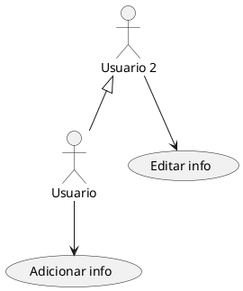

# mizudo-app
Aplicação para gerenciamento de membros da associação Mizu-do de Karatê

# Caso de Uso

```plantuml
@startuml
actor Usuario as us
actor "Usuario 2" as us2

usecase "Adicionar info" as ai
usecase "Editar info" as ae

us --> ai
us2 --> ae 

us2 <|-- us

@enduml
```
